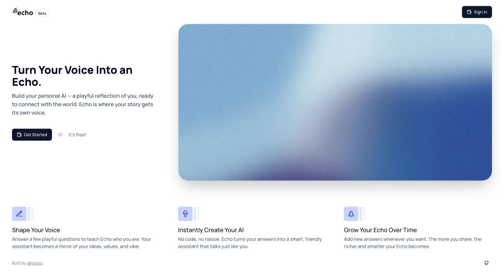
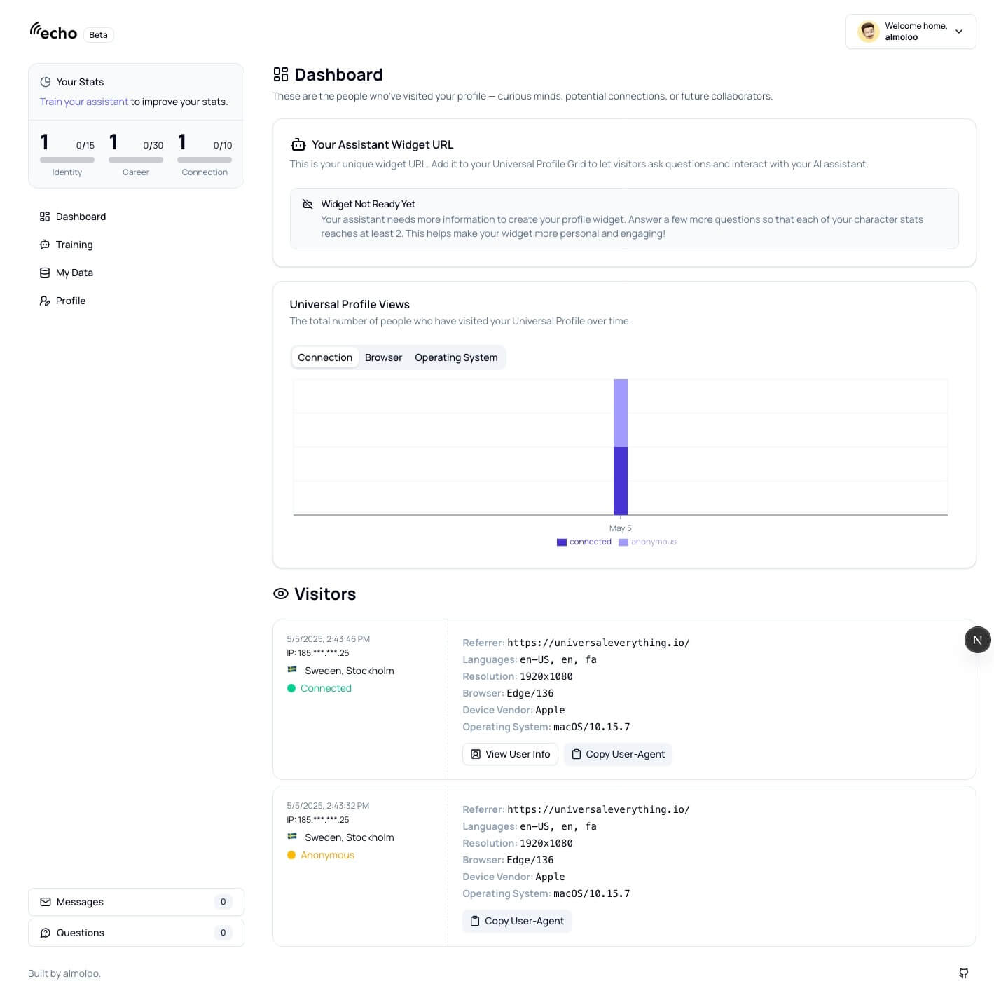

# 🔮 Echo

<div align="center">
  
  
  [](https://www.typescriptlang.org/)
  [](https://nextjs.org/)
  [](https://lukso.network/)
  [](https://lukso.network/)
  [](https://github.com/username/echo)
  
  <h3>AI-powered assistant widget for Lukso Universal Profiles</h3>
</div>

## 📋 Table of Contents

- [Overview](#overview)
- [Features](#features)
- [Demo](#demo)
- [Tech Stack](#tech-stack)
- [Architecture](#architecture)
- [Getting Started](#getting-started)
  - [Prerequisites](#prerequisites)
  - [Installation](#installation)
  - [Configuration](#configuration)
- [Usage](#usage)
- [API Reference](#api-reference)
- [Smart Contract Documentation](#smart-contract-documentation)
- [Testing](#testing)
- [Deployment](#deployment)
- [Roadmap](#roadmap)
- [Contributing](#contributing)
- [Code of Conduct](#code-of-conduct)
- [License](#license)
- [Acknowledgements](#acknowledgements)
- [Contact](#contact)

## 🔍 Overview

Echo is an AI-powered widget designed specifically for Lukso Universal Profiles, creating personalized digital assistants that authentically represent profile owners in the Lukso ecosystem. By answering AI-generated questions across categories like career, identity, and connection, profile owners train a dedicated assistant that engages with visitors on their behalf.

This innovative widget serves as a digital concierge for your Universal Profile, allowing visitors to ask questions, send messages, or donate LYX directly through the interface. When the assistant encounters questions it can't answer, it logs them for the profile owner to review later, continuously improving the experience over time.

Echo includes a comprehensive analytics dashboard where profile owners can monitor visitor interactions, including device information, geographic location, and visitor profile details (when available). During its beta phase, Echo is completely free for Lukso Universal Profile owners.

## ✨ Features

- **Personal AI Assistant**: Train an AI assistant that represents you through guided questions about your career, identity, and connections, combined with your public profile data.
- **Visitor Engagement**: Allow visitors to ask questions, send messages, or donate LYX directly through an intuitive widget interface.
- **Continuous Learning**: Any questions the assistant can't answer are logged for review, helping you improve your digital representation over time.
- **Analytics Dashboard**: Access comprehensive analytics including visitor metrics (device, location, profile info when available) and unanswered question logs.
- **Universal Profile Integration**: Seamlessly integrates with Lukso Universal Profiles, leveraging blockchain authentication and transaction capabilities.
- **Free Beta Access**: Use all features completely free during the beta phase.

## 🎮 Demo

Experience the application firsthand:

- 🌐 **Live Demo**: [https://echo.almoloo.com](https://echo.almoloo.com)
- 💻 **Widget Preview**: [See how the widget will appear on your own profile](https://universaleverything.io/0x6C863ae49F6cef7ab24a548f3900d8698361578B?assetGroup=grid)

<div align="center">
  
</div>

During the beta phase, you can connect your own Universal Profile and experience the full feature set for free.

## 🛠️ Tech Stack

<table>
  <tr>
    <td align="center"><strong>Frontend</strong></td>
    <td align="center"><strong>Backend</strong></td>
    <td align="center"><strong>Blockchain</strong></td>
    <td align="center"><strong>AI & Analytics</strong></td>
  </tr>
  <tr>
    <td>
      • Next.js<br>
      • TypeScript<br>
      • TailwindCSS<br>
      • shadcn/ui<br>
    </td>
    <td>
      • Node.js<br>
      • Next.js API Routes<br>
      • MongoDB<br>
      • NextAuth
    </td>
    <td>
      • Lukso Standards<br>
      • Universal Profiles<br>
      • ERC725<br>
      • viem.js
    </td>
    <td>
      • OpenAI API<br>
      • Analytics Dashboard<br>
      • ipapi.co
    </td>
  </tr>
</table>

## 🏗️ Architecture

Echo uses a modular architecture that combines AI technologies with blockchain capabilities. The widget embeds into Universal Profiles through a lightweight iFrame page, while the core services handle data processing, AI training, and blockchain interactions.

<div align="center">
  
</div>

The system consists of four main components:

1. **Widget Frontend**: An embeddable interface that integrates with Lukso Universal Profiles
2. **AI Engine**: Processes profile data and visitor interactions to create personalized responses
3. **Blockchain Integration Layer**: Handles authentication, donations, and Universal Profile interactions
4. **Analytics Service**: Collects and processes visitor data

## 🚦 Getting Started

### Prerequisites

- A Lukso Universal Profile
- Node.js 18.x or higher (for development)
- npm (for development)
- MongoDB (for local development)
- [Universal Profiles browser extension](https://chromewebstore.google.com/detail/universal-profiles/abpickdkkbnbcoepogfhkhennhfhehfn?pli=1)

### Installation

#### For Profile Owners

1. Navigate to [echo.almoloo.com](https://echo.almoloo.com)
2. Connect your Lukso Universal Profile
3. Complete the training questionnaire to train your AI assistant
4. Copy the widget embed code provided to your profile grid

#### For Developers

1. Clone the repository:

   ```bash
   git clone https://github.com/almoloo/echo.git
   cd echo
   ```

2. Install dependencies:

   ```bash
   npm install
   ```

3. Set up environment variables:

   ```bash
   cp .env
   # Edit .env with your configurations
   ```

4. Run the project:
   ```bash
   npm run dev
   ```

### Configuration

Explain important configuration options and environment variables:

```env
# Required environment variables
NEXTAUTH_SECRET=a_random_hash
NEXTAUTH_URL=http:localhost:3000
DB_URI=MongoDB_connection_string
OPENAI_API_KEY=your_api_key
NEXT_PUBLIC_URL=http:localhost:3000
```

## 📖 Usage

### For Profile Owners

After connecting with Universal Profile extension, you'll have access to your Echo dashboard where you can:

1. **Monitor Analytics**: Track visitor interactions and view unanswered questions
2. **Train Your Assistant**: Answer to AI-generated questions to train your assistant
3. **View Messages**: View messages delivered to you through your assistant
4. **View Questions**: View and respond to questions that the assistant didn't have enough data to respond to
5. **View and Modify Answers**: View and modify/remove answers you have previously provided

<div align="center">
  
</div>

### For Visitors

Visitors to a profile with Echo installed can:

1. **Ask Questions**: Get immediate responses about the profile owner
2. **Send Messages**: Leave messages for the profile owner
3. **Send Donations**: Support the profile owner with LYX donations

## 📜 Lukso Integration

Echo integrates with Lukso Universal Profiles and leverages blockchain capabilities:

### Key Universal Profile Integrations

Echo interacts with the Universal Profile standard to:

1. **Authenticate owners** using UP browser extension
2. **Fetch public profile data** like name, description, and profile image
3. **Process donations** through the LSP7 digital asset standard

## 🗺️ Roadmap

Here's our planned development roadmap for Echo:

- **Q2 2025**:

  - Public beta launch
  - Core widget functionality
  - Basic analytics dashboard
  - LYX donation support

- **Q3 2025**:

  - Enhanced AI training capabilities
  - Multi-language support
  - LSP7/LSP8 token support for donations

- **Q4 2025**:

  - Voice interaction support
  - Advanced analytics with AI-powered insights
  - Widget customization options

- **Q1 2026**:
  - Integration with other profile systems
  - Custom AI model training options
  - Premium features introduction

## 👥 Contributing

We welcome contributions! Please follow these steps:

1. Fork the repository
2. Create a feature branch: `git checkout -b feature/amazing-feature`
3. Commit your changes: `git commit -m 'Add amazing feature'`
4. Push to the branch: `git push origin feature/amazing-feature`
5. Open a Pull Request

## 👏 Acknowledgements

- [Lukso Network](https://lukso.network/) for the Universal Profile standards
- [Next.js](https://nextjs.org/) for the React framework
- [TailwindCSS](https://tailwindcss.com/) for styling
- [MongoDB](https://www.mongodb.com) for database access
- [OpenAI](http://openai.com/) for AI API
- All our beta testers and contributors

## 📬 Contact

- **Project Maintainer**: Ali Mousavi - [@almoloo](https://twitter.com/almoloo)
- **Email**: amousavig@icloud.com
- **Project Link**: [https://github.com/almoloo/echo](https://github.com/almoloo/echo)

---

<div align="center">
  Made with ☕ by almoloo
</div>
